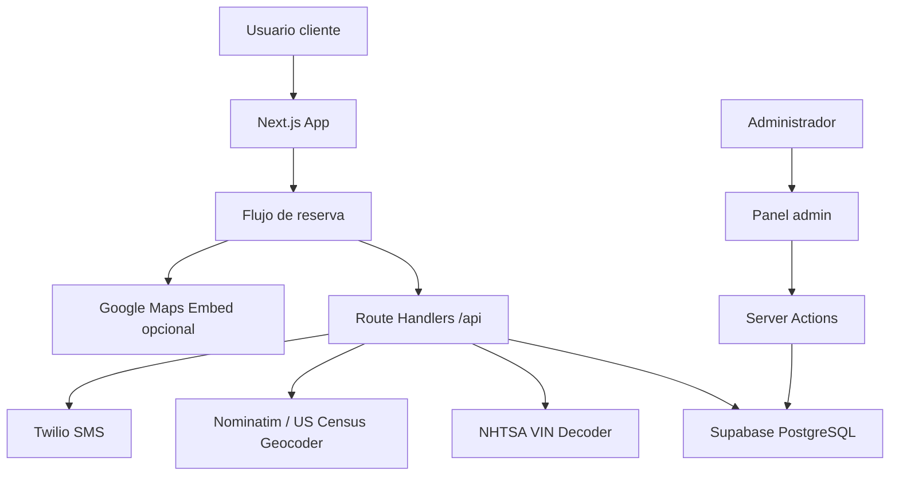

# MechNow

## Descripcion
MechNow es una aplicacion web mobile-first para reservar servicios de mecanica movil en el area de Sacramento. Permite a los clientes validar cobertura por codigo ZIP, registrar datos del vehiculo, seleccionar servicios, confirmar direccion, escoger fecha y hora, y enviar una solicitud de cita.

La aplicacion tambien incluye un panel administrativo protegido para gestionar citas, tecnicos, codigos ZIP de cobertura y resenas de clientes.

## Integrantes
- JUAN FELIPE JAUREGUI CARRILLO - 1091967749
- CARLOS DANIEL DAZA MEDINA - 1092942341

## Tecnologias
- Framework: Next.js 16.2.6 App Router
- Lenguaje: TypeScript 5.9.3
- UI: React 19.2.4, Tailwind CSS 4.3.0, shadcn/Base UI, lucide-react
- Backend: Next.js Route Handlers y Server Actions
- Base de datos: Supabase PostgreSQL
- Validacion: Zod 4.4.3
- Autenticacion admin: JWT con jose 6.2.3 y bcryptjs 3.0.3
- SMS opcional: Twilio 6.0.2
- Pruebas: Vitest 4.1.6
- Gestor de paquetes: pnpm 10.32.0
- Version de Node usada en validacion local: Node.js 24.13.0
- Version minima recomendada: Node.js 20 o superior

## Arquitectura
La aplicacion usa la arquitectura App Router de Next.js. Las paginas principales viven en `app/`, los componentes reutilizables en `components/`, la logica de negocio en `lib/`, los tipos compartidos en `types/` y el script de base de datos en `scripts/`.



Descripcion por capas:
- Presentacion: paginas publicas, flujo de reserva y panel administrativo.
- Componentes: formularios, tabs, dialogos, tarjetas, pasos de reserva y secciones de resenas.
- Servicios internos: validadores, utilidades de fecha, Supabase, Twilio, VIN, geocodificacion y ZIPs.
- Persistencia: tablas de citas, tecnicos, resenas, usuarios admin, ZIPs y lista de espera en Supabase.
- Seguridad: cookie `admin_session`, JWT firmado con `SESSION_SECRET`, rutas admin protegidas por `proxy.ts` y validacion de sesion en Server Actions.

## Especificaciones Funcionales
- [x] Landing publica con informacion del servicio.
- [x] Interfaz bilingue ingles/espanol con selector de idioma.
- [x] Flujo de reserva mobile-first de 8 pasos.
- [x] Validacion de cobertura por codigo ZIP.
- [x] Registro en lista de espera para ZIPs sin cobertura.
- [x] Registro manual de informacion del vehiculo.
- [x] Decodificacion opcional de VIN mediante NHTSA.
- [x] Seleccion multiple de servicios: aceite, bateria, frenos, diagnostico, mantenimiento, aire acondicionado, sistema electrico, llantas e inspeccion general.
- [x] Validacion de direccion con servicios externos y fallback de confirmacion manual.
- [x] Confirmacion de ubicacion con Google Maps si existe API key.
- [x] Captura de datos personales del cliente.
- [x] Consulta de disponibilidad por fecha y horarios fijos.
- [x] Creacion de citas en Supabase.
- [x] Prevencion de doble reserva para una misma fecha y hora.
- [x] Envio opcional de SMS al cliente y al administrador con Twilio.
- [x] Formulario publico de resenas.
- [x] Moderacion de resenas desde el panel administrativo.
- [x] Login administrativo con email, contrasena, bcrypt y JWT.
- [x] Proteccion de rutas `/admin`.
- [x] Dashboard administrativo con metricas de citas.
- [x] Gestion de estados de citas: pendiente, postergada, completada y cancelada.
- [x] Asignacion de tecnicos a citas.
- [x] Gestion de tecnicos.
- [x] Gestion de codigos ZIP de cobertura.
- [x] Script SQL completo para crear la base de datos en Supabase.
- [x] Pruebas unitarias para utilidades, fechas y validadores.

## Instalacion y Ejecucion
Requisitos:
- Node.js 20 o superior.
- pnpm instalado.
- Proyecto de Supabase para probar persistencia, reservas y panel admin.

Desde la carpeta raiz real del proyecto:

```bash
cd c:/Users/juanitou/Downloads/mechnow/mechnow
pnpm install
```

Crear el archivo `.env.local` tomando como base `.env.example`:

```env
NEXT_PUBLIC_SUPABASE_URL=
NEXT_PUBLIC_SUPABASE_ANON_KEY=
SUPABASE_SERVICE_ROLE_KEY=

TWILIO_ACCOUNT_SID=
TWILIO_AUTH_TOKEN=
TWILIO_PHONE_NUMBER=
ADMIN_PHONE_NUMBER=

NEXT_PUBLIC_GOOGLE_MAPS_API_KEY=

SESSION_SECRET=
```

Preparar Supabase:
1. Crear un proyecto en Supabase.
2. Abrir SQL Editor.
3. Ejecutar `scripts/004-full-setup.sql`.
4. Generar hash bcrypt para el administrador:

```bash
node -e "require('bcryptjs').hash('TU_PASSWORD', 12).then(console.log)"
```

5. Insertar el administrador en Supabase:

```sql
insert into admin_users (email, password_hash)
values ('admin@example.com', 'HASH_BCRYPT_GENERADO');
```

Ejecutar en desarrollo:

```bash
pnpm dev
```

Abrir:
- Inicio: `http://localhost:3000`
- Reserva: `http://localhost:3000/booking`
- Login admin: `http://localhost:3000/admin/login`
- Dashboard admin: `http://localhost:3000/admin/dashboard`

Validar el proyecto:

```bash
pnpm lint
pnpm test
pnpm build
```

Resultado de validacion local:
- `pnpm lint`: correcto.
- `pnpm test`: 3 archivos y 14 pruebas correctas.
- `pnpm build`: correcto.

Nota: sin `.env.local`, las paginas publicas cargan, pero los servicios que requieren Supabase responden como no disponibles.

## Capturas de Pantalla
| Pantalla | Captura |
|---|---|
| Home | `screenshots/home.png` |
| Flujo de reserva | `screenshots/booking.png` |
| Login admin | `screenshots/admin-login.png` |
| Dashboard admin | `screenshots/admin-dashboard.png` |

Las capturas deben agregarse en una carpeta `screenshots/` cuando se prepare la entrega visual del proyecto.

## Servicios Web Consumidos
| Metodo | Endpoint | Descripcion |
|---|---|---|
| GET | `https://vpic.nhtsa.dot.gov/api/vehicles/DecodeVinValuesExtended/{vin}?format=json` | Decodifica VIN y obtiene ano, marca, modelo y motor del vehiculo. |
| GET | `https://nominatim.openstreetmap.org/search` | Busca y valida direcciones mediante OpenStreetMap/Nominatim. |
| GET | `https://geocoding.geo.census.gov/geocoder/locations/onelineaddress` | Servicio alterno de geocodificacion del US Census. |
| GET | `https://www.google.com/maps/embed/v1/view` | Muestra mapa embebido para confirmar ubicacion, si existe API key. |
| POST | Twilio Messages API | Envia SMS opcionales al cliente, administrador o tecnico. |
| REST | Supabase API | Lee y escribe citas, ZIPs, resenas, tecnicos y usuarios administradores. |

## Endpoints Internos
| Metodo | Ruta | Descripcion |
|---|---|---|
| GET | `/api/zip-city?zip=95814` | Retorna ciudad y estado para ZIPs conocidos de Sacramento. |
| GET | `/api/service-zip-codes` | Lista los ZIPs con cobertura configurados en Supabase. |
| GET | `/api/service-zip-codes?zip=95814` | Valida si un ZIP tiene cobertura. |
| POST | `/api/waitlist` | Registra email y ZIP en lista de espera. |
| GET | `/api/decode-vin?vin=...` | Decodifica informacion del vehiculo desde un VIN. |
| POST | `/api/validate-address` | Valida una direccion y devuelve coordenadas si estan disponibles. |
| GET | `/api/availability?date=YYYY-MM-DD` | Retorna horarios ocupados y disponibles para una fecha. |
| POST | `/api/appointments` | Crea una solicitud de cita. |
| GET | `/api/reviews` | Lista resenas aprobadas. |
| POST | `/api/reviews` | Envia una resena pendiente de moderacion. |

## Conclusiones
Durante el desarrollo de MechNow se aprendio a estructurar una aplicacion web moderna con Next.js App Router, separando correctamente paginas, componentes, validaciones, servicios externos y persistencia.

Tambien se reforzo la importancia de validar datos tanto en cliente como en servidor, proteger rutas administrativas, manejar integraciones opcionales sin romper el flujo principal y crear una base de datos con restricciones que eviten errores como dobles reservas.

El proyecto demuestra un flujo completo de negocio: captacion del cliente, reserva, persistencia, notificaciones opcionales y gestion administrativa.
